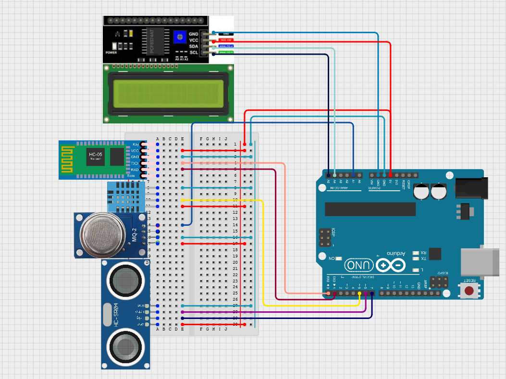

# Silo Monitoring System
##### To monitor the quality and quantity of grains in storage

 
---

## Contributors
>- [Sayan Das](mailto:geniussayan7@gmail.com) 
>- [Raunak Saigal](mailto:saigalraunak@gmail.com) 
>- [Sagnik Sinha](mailto:sagniksinha.2004@gmail.com) 
>- [Navonil Ganguli](mailto:navonilganguli@gmail.com) 
>- [Shweta Dutta](mailto:sdmaze789@gmail.com)
>- [Ayaan Gopal Ray](mailto:ayaang.ray@gmail.com)

## Problems in the Industry

Maintaining optimal storage conditions inside the silos poses significant challenges, including temperature variations, moisture ingress, and pest infestations, which can lead to spoilage and financial losses for farmers and storage facility operators. Traditional methods of silo monitoring often rely on manual inspections, which are labour-intensive, time-consuming, and prone to human error. 

## Proposed Solution

An automated Silo Monitoring System having the following features -

- monitors temperature and humidity inside the silo
- Detects the presence of gases which may signify the rotting of the grains stored
- moniors the quantiy of grains inside the silo
- displays all these status in mobile phones connected via bluetooth

## Harwares and Sensors used

>- Arduino Uno R3
>- DHT11 Temperature and Humidity sensor
>- MQ2 gas sensor
>- HC-SR04 ultrasonic sound sensor
>- HC-05 blutooth module
>- LCD Display
>- pcf8574 I2C Serial interface for LCD Display

## Libraries Used

- [DHT11 Library](https://codeload.github.com/adidax/dht11/legacy.zip/refs/heads/master)
- [LiquidCrystal Library](https://downloads.arduino.cc/libraries/github.com/arduino-libraries/LiquidCrystal-1.0.7.zip)

## Circuit Diagram

## Problems and Contributions

The current solution does not employ and industrial approach but rather is a proof-of-concept as a hobby project. We tend to improve the user experience and 
Anyone is more than welcome to contribute, add features, or use this code to implement new features in this code.

